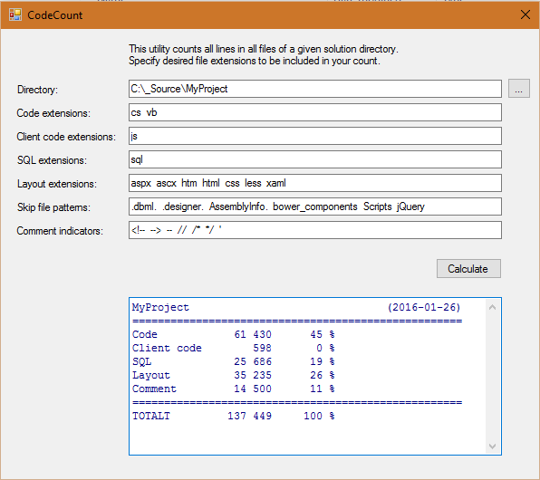

# CodeCount

## Background
Sometimes I am curious to compare code projects to compare the relative code size.

## Features
- Specify a source base directory
- Specify extensions for all files to be included
- Enter pattern for files to be excluded (from above extensions)
- Enter pattern for comment lines
- Copy result for future reference

## Installation
- Download source
- Compile
- All needed code is contained in the EXE file and related config: CodeCount.exe + CodeCount.exe.config
- Put file wherever you want and run it

